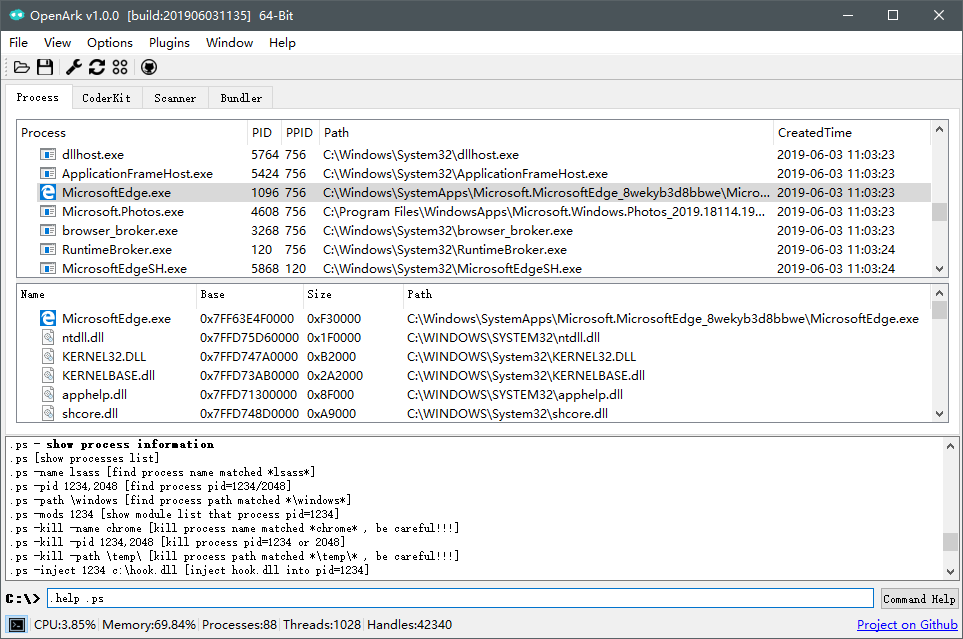

# OpenArk 

### Introduction
OpenArk is a open source toolkit on Windows. Ark is Anti Rootkit abbreviated, it aimmed at reversing/programming helper and also users can find out malwares in the OS. More and more commands will be supported in future.

### Features
* Process - Process/Thread/Module information view, Dll Injector x86/x64.
* Scanner - PE file parsers.
* CoderKit - Helper for coders.
* Bundler - Directory and files could be bundled to one executable file, it also support scripts.
* Commands - Many useful coammands in there.
* More features in developing...

### Requirement
* [UNONE](https://github.com/BlackINT3/none)
* [Qt 5.6.2](https://download.qt.io/official_releases/qt/5.6/5.6.2/)

### Distributions
* Binaray (exe)
  * one binaray, no dependence, support 32/64 bit.
* Supported OS
  * Windows XP/2003
  * Windows Vista/7/2008
  * Windows 8/8.1/2012
  * Windows 10/2016/2019
* Supported Compiler
  * Visual Studio 2015 (vc140)
  * Visual Studio 2017 (vc141)
  * Visual Studio 2019 (vc142)

### How to compile
* install UNONE static library .
* install Qt static library.
* just build it, current is vs2015 project.

### Contributing
  * Issues and Push request is welcome.