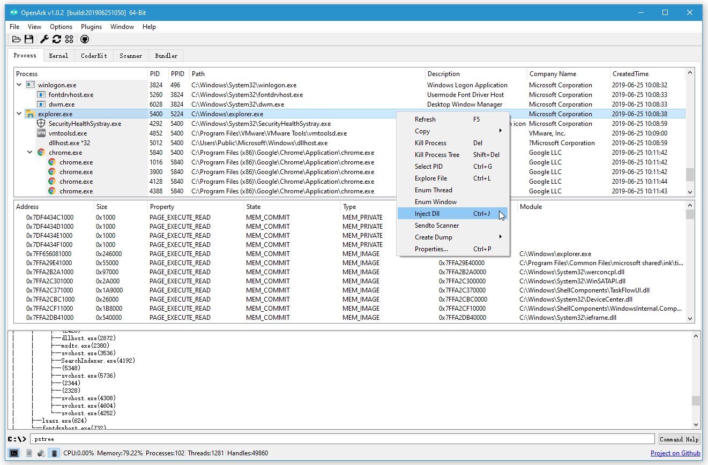

# OpenArk 

### Official Links
* Website: https://openark.blackint3.com/
* Source: https://github.com/BlackINT3/OpenArk/
* Manuals: https://openark.blackint3.com/manuals/
* QQ Qun: 836208099

### Introduction
* [中文说明](https://github.com/BlackINT3/OpenArk/blob/master/doc/README-zh.md)

* OpenArk is a open source anti-rookit(Ark) tool on Windows. Ark is Anti Rootkit abbreviated, it aimmed at reversing and programming helper, users also can use it to find out malwares in the OS. More and more commands will be supported in future.

### Features
* Process - Process/Thread/Module/Handles/Memory/Window... information view, Dll Injector x86/x64.
* Kernel - OS Kernel internal toolkit, eg: Drivers, Callback, Filters, IDT/SDT, WFP and more in future.
* CoderKit - Helper for coders.
* Scanner - PE file parsers, evolved to virus analyzer in future.
* Bundler - Directory and files could be bundled to one executable file, it also support scripts.
* Commands - Many useful coammands in there.
* Language - support English and Chinese now, more languages in future.
* More features in developing...

### Requirement
* [UNONE & KNONE](https://github.com/BlackINT3/none) - User & Kernel mode BaseLibrary
* [Qt 5.6.2](https://download.qt.io/official_releases/qt/5.6/5.6.2/) - GUI Framework

### Distributions
* Binary (exe)
  * one binary, no dependence, support 32/64 bit.
* Supported OS
  * Windows XP/2003/Vista/7/2008/8/8.1/2012/10/2016/2019
* Supported Compiler
  * Visual Studio 2015/2017/2019

### How to compile
* install UNONE static library, vs2015-unone.nupkg.
* install Qt static library.
* just build it, current is vs2015 project.

### Contributing
  * Issues and Push request is welcome.

  * QQ Qun: 836208099

  
