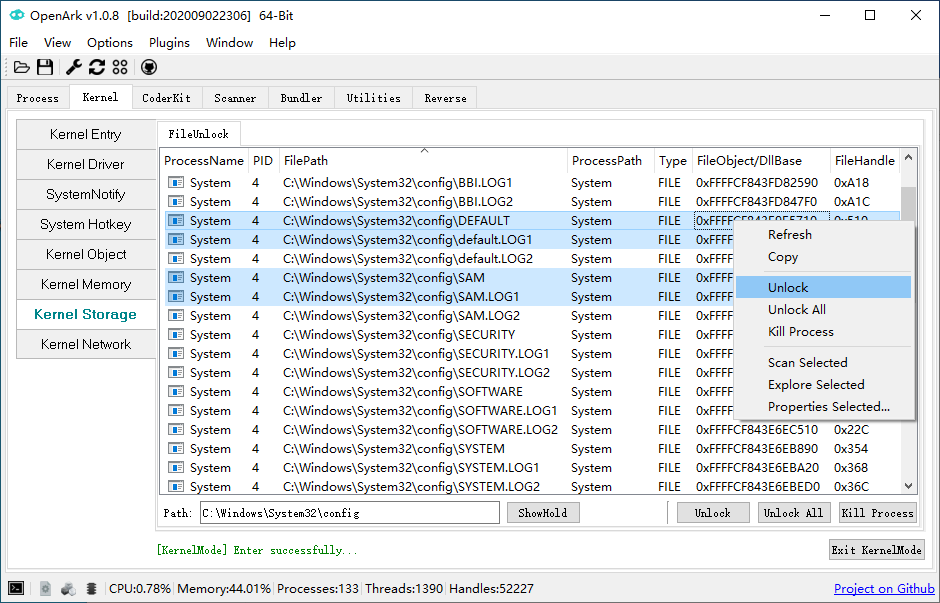
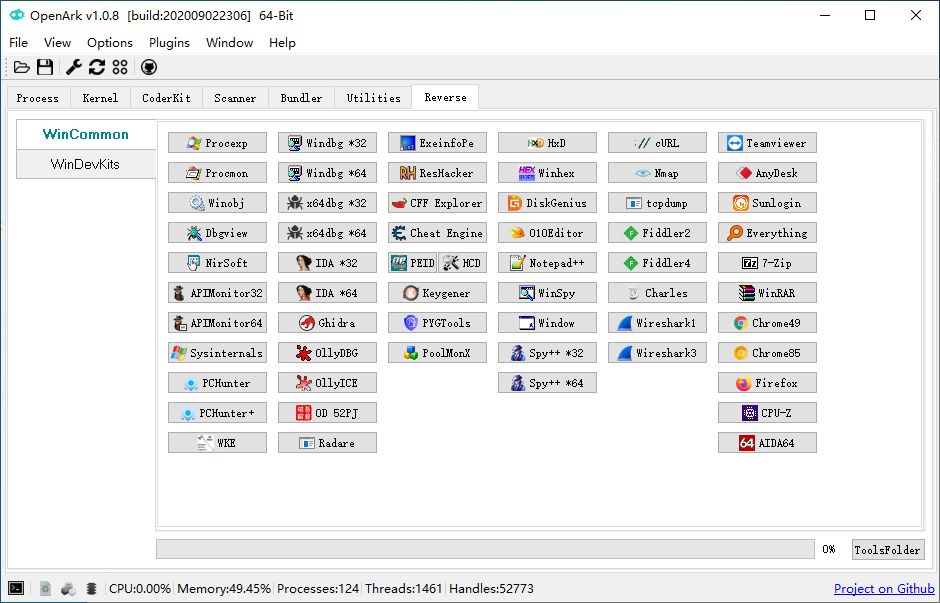

# OpenArk 

### Introduction
* [中文说明](doc/README-zh.md)

* OpenArk is an open source anti-rookit(ARK) tool for Windows. Ark is Anti-Rootkit abbreviated, it aimmed at reversing/programming helper and also users can find out hidden malwares in the OS. More and more powerful features will be supported in future.

### Features
* Process - Process/Thread/Module/Handles/Memory/Window... information view, Dll Injector x86/x64.
* Kernel - OS Kernel internal toolkit, eg: Memory, Drivers, Hotkey, Callback, Filters, IDT/SDT/NDIS/WFP etc.
* CoderKit - Helper for coders.
* Scanner - PE/ELF file parsers, evolved to virus analyzer in future.
* Bundler - Directory and files could be bundled to one executable file, it also support scripts.
* Utilities - Cleaner/System tools etc.
* Reverse - Collect many useful tools that functional complementation each others, for efficient, always thinking.
* Console - Many useful coammands in here.
* Language - Support English and Chinese now, more in future.
* More powerful features in developing...

### Distributions
* Program: one exe binary, no dependence, support 32/64 bit.
* Supported OS: Windows XP ... Win7 ... Win10 20H2  ...

### Compile
* [How To Build OpenArk](doc/build-openark.md)
* [UNONE & KNONE](https://github.com/BlackINT3/none) - User & Kernel mode BaseLibrary

### Contributing/Donate
  * Issues and Push Request is welcome.
  * If you like that you can donate to our develop.
  * [OpenArk Code Style Guide](doc/code-style-guide.md)

### Official Links
* Website: https://openark.blackint3.com/
* Source: https://github.com/BlackINT3/OpenArk/
* Manuals: https://openark.blackint3.com/manuals/
* QQ Group: 836208099
