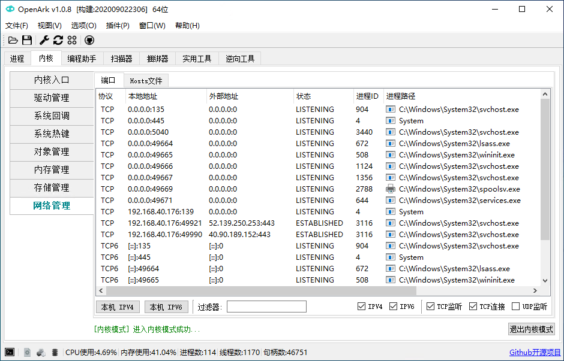
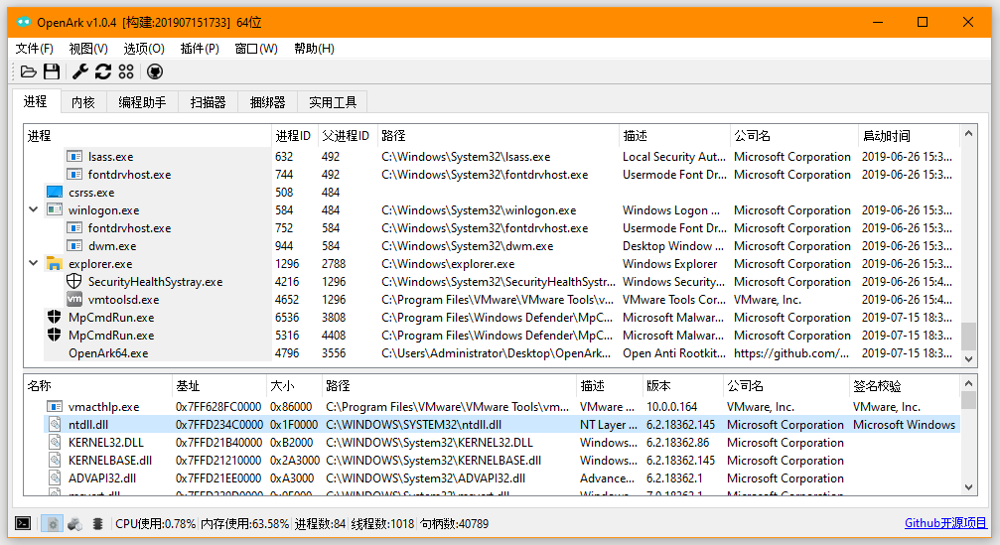
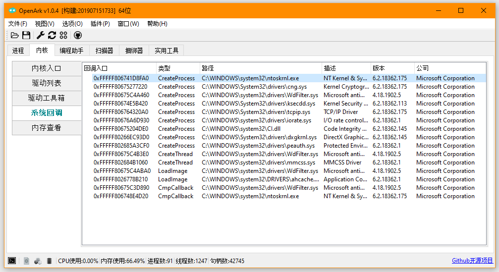

# OpenArk 

### 紹介
* [英語の説明](../README.md)
* [中国語の説明](README-zh.md)

&ensp;&ensp;OpenArkは、Windowsプラットフォーム向けのオープンソースのArkツールです。ArkはAnti-Rootkit（アンチルートキット）の略で、OpenArkはリバースエンジニアリングやプログラミングの支援を目的としています。また、ユーザーがOS内の隠れたマルウェアを見つけるのにも役立ちます。将来的には、さらに多くの強力な機能がサポートされる予定です。

### 機能
* プロセス - プロセス、スレッド、モジュール、ハンドル、メモリ、ウィンドウ、トークン、メモリスキャン、PPLなどの情報表示、モジュールのアンロード、プロセスの注入などの機能。
* カーネル - OSカーネル内部ツール、例：メモリ、ドライバ、ホットキー、コールバック、フィルタ、IDT/SDT/NDIS/WFPなど。
* プログラミング支援 - プログラマーのためのツール。
* スキャナー - PE/ELFファイルパーサー、将来的にはウイルス解析ツールに進化。
* バンドラー - ディレクトリとファイルを1つの実行可能ファイルにバンドル、スクリプトもサポート。
* ツールリポジトリ - 多くの有用なツールを収集し、機能補完を行い、効率的に使用。
* コンソール - 多くの有用なコマンドがここにあります。
* 言語 - 現在は中国語と英語をサポート、将来的にはさらに多くの言語をサポート予定。
* さらに多くの強力な機能が開発中...

### 配布
* プログラム：1つのexeバイナリ、依存関係なし、32/64ビット対応。
* サポートされているOS：Windows XP ... Win7 ... Win10 ... Win11 ...

### コンパイル
* [OpenArkのビルド方法](build-openark.md)
* [UNONE & KNONE](https://github.com/BlackINT3/none) - ユーザーモードとカーネルモードの基本ライブラリ

### 貢献/寄付
  * Issueとプルリクエストを歓迎します。
  * OpenArkが気に入ったら、ソフトウェア上で寄付をクリックして、開発をサポートしてください。
  * [OpenArk コードスタイルガイド](code-style-guide.md)

### 連絡先
* Discord
  - https://discord.com/invite/w9A8q9naDY
* QQグループ
  - グループ5: 981859796
  - グループ4: 960562534(満員)
  - グループ3: 706663529(満員)
  - グループ2: 535752025(満員)
  - グループ1: 836208099(満員)

### 公式リンク
* 公式ウェブサイト: https://openark.blackint3.com/
* プロジェクトURL: https://github.com/BlackINT3/OpenArk/
* マニュアル: https://openark.blackint3.com/manuals/
