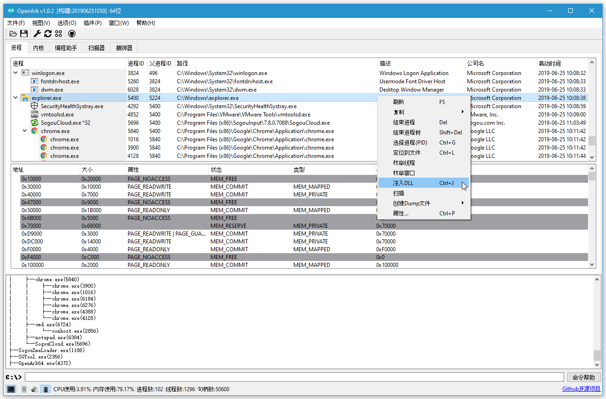

# OpenArk 

### 官方链接
* 官方网站: https://openark.blackint3.com/
* 项目地址: https://github.com/BlackINT3/OpenArk/
* 帮助手册: https://openark.blackint3.com/manuals/
* QQ群: 836208099

### 简介
* [英文说明](https://github.com/BlackINT3/OpenArk/blob/master/README.md)

&ensp;&ensp;OpenArk是一款Windows平台上的开源Ark工具. Ark是Anti-Rootkit（对抗恶意程序）的简写, OpenArk目标成为逆向工程师、编程人员的工具，同时也能为那些希望清理恶意软件的用户服务。以后也将会支持更多功能和命令。

### 功能
* 进程 - 查看进程、线程、模块、句柄、内存、窗口等信息，提供进程注入器等功能。
* 内核 - 系统内核工具，例如：驱动、回调、过滤器、IDT/SDT WFP等功能，以后会支持更多。
* 编程助手 - 程序员的工具箱。
* 扫描器 - PE文件解析器，以后会变成病毒分析助手。
* 捆绑器 - 目录和多个程序可以捆绑成一个exe程序，同时支持脚本。
* 控制台 - 这里有很多有用的命令。
* 语言 - 目前支持中文和英文，以后会支持更多语言。
* 更多功能正在开发中。。。

### 依赖
* [UNONE & KNONE](https://github.com/BlackINT3/none) - 应用层&内核层基础库
* [Qt 5.6.2](https://download.qt.io/official_releases/qt/5.6/5.6.2/)  - GUI开发框架

### 发布
* 二进制 (exe)
  * 独立的exe，无DLL依赖，支持32位、64位。
* 支持的操作系统
  * Windows XP/2003/Vista/7/2008/8/8.1/2012/10/2016/2019
* 支持的编译器
  * Visual Studio 2015/2017/2019

### 如何编译
* 安装UNONE静态库Nuget包，例如VS2015：vs2015-unone.nupkg。
* 安装Qt静态库。
* 编译即可，目前是VS2015工程开发。

### 参与项目
  * 欢迎提交Issue和PR.

  * QQ群: 836208099

  