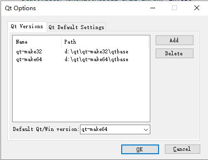

# 如何构建 OpenArk

* [英文说明](build-openark.md)

### 只需四步，轻松愉快!

#### 安装 WDK
- 下载 [WDK 7601](http://nuget.blackint3.com:20001/wdk71.iso) 版本的安装包，之后安装
- 在用户环境变量里新建一个环境变量，变量名是 WDKPATH，变量值是 WDK 的安装根目录。例：C:\WINDDK\7600.16385.1

#### 安装 Visual Studio
- 下载 [Visual Studio 2015 (Update 3)](http://nuget.blackint3.com:20001/vs2015.iso) 的安装包 ，之后安装
- **重要**：你必须在安装向导中选择 Visual Studio 拓展性工具 Update 3

#### 安装Qt基础库
- 下载 [qt5.6.2-static-lib.zip](http://nuget.blackint3.com:20001/qt5.6.2-static-lib.zip) qt 静态库的压缩包，之后将其解压到自定义的路径（你也可以参照教程自己编译一个 qt 静态库）
- 安装VS2015的 qt 插件 [qt-vsaddin-msvc2015-2.4.3.vsix](http://nuget.blackint3.com:20001/qt-vsaddin-msvc2015-2.4.3.vsix)
- 在 qt 插件中指定刚才解压 qt 静态库的路径，在 (Qt Vs Tools - Qt Options) 中添加 qt-make32, qt-make64 版本的静态库路径

- 在 qt 插件中指定项目默认选用的 qt 版本， 在 (Qt Vs Tools - Qt Project Settings), 设置构建 x64 为 qt-make64, x86 为 qt-make32. 

#### 添加Nuget包仓库
- 添加 Nuget 包仓库，在（VS 工具 - 选项 - Nuget 包管理器 - 程序包源）
- Nuget 包仓库名称：NugetRepoServer
- Nuget 包仓库源：http://nuget.blackint3.com:20001/api/odata
- 其他方式：你也可通过这份文档 [NONE Manual](https://github.com/BlackINT3/none) 来安装

### 现在可以编译openark了

### Q&A
* Q：编译 OpenArk 的驱动时，提示没找到ntifs.h（not found ntifs.h）
* A：首选确保 WDKPATH 环境变量设置准确。如设置准确后仍出现，请重启 explorer.exe 和 vs2015。