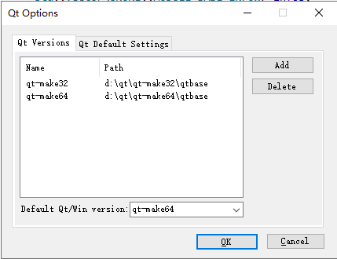
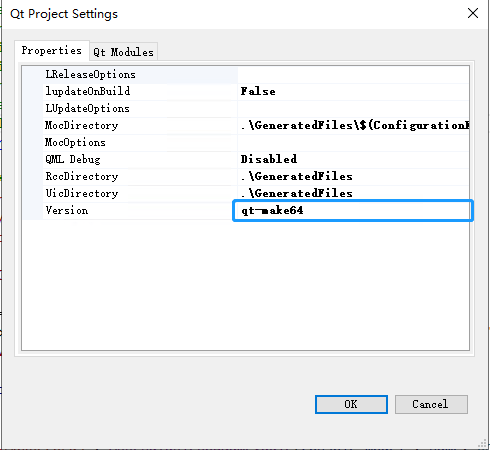

# How To Build OpenArk

### You need four steps just easily!

#### Install WDK
* Download [WDK 7601](http://nuget.blackint3.com:20001/wdk71.iso) and install it
* Add user environment value WDKPATH that set value to WDK root directory, eg: C:\WINDDK\7600.16385.1

#### Install Visual Studio
* Download [Visual Studio 2015 (Update 3)](http://nuget.blackint3.com:20001/vs2015.iso) and install it
* Important: You must select (Visual Studio 2015 Update 3) in install wizard

#### Install Qt
* Download [qt5.6.2-static-lib.zip](http://nuget.blackint3.com:20001/qt5.6.2-static-lib.zip) and unzip it (you can also build by your self).
* Install qt extension of vs2015 [qt-vsaddin-msvc2015-2.4.3.vsix](http://nuget.blackint3.com:20001/qt-vsaddin-msvc2015-2.4.3.vsix)
* Specific the path, and (Qt Vs Tools - Qt Options) add qt-make32, qt-make64 versions

* Specific the project version, (Qt Vs Tools - Qt Project Settings), and set build x64 configration to qt-make64, x86 to qt-make32. 

#### Add Nuget Package Repoistry
* Add nuget repoistry (VS Tools - Options - Nuget Package Manager - Package Sources）
* Name: NugetRepoServer
* Repoistry: http://nuget.blackint3.com:20001/api/odata
* Alternative: You can also install according to [NONE Manual](https://github.com/BlackINT3/none)

### Now go ahead, build it.

### Q&A
* Q: Build OpenArk driver, not found ntifs.h?
* A: Be sure WDKPATH environment setting ok, may be you should restart explorer and vs2015.